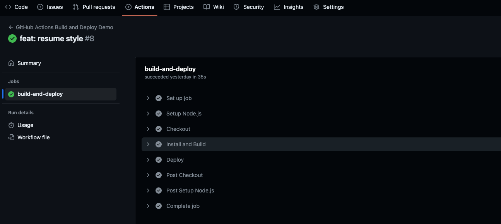
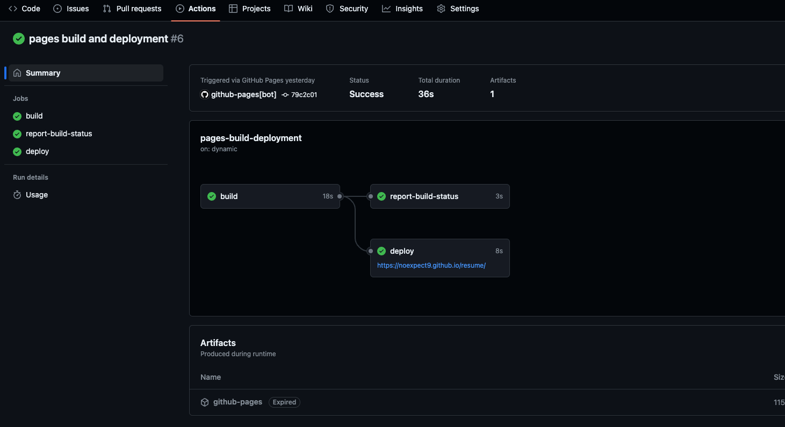
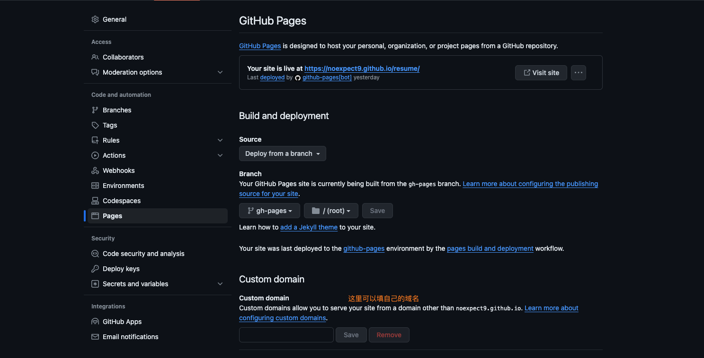
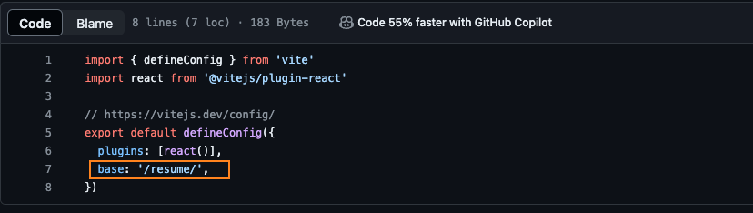

## 使用github actions构建并部署

  平时开发时，可能没有线上服务器，这时候就可以考虑使用第三方的 CI/CD 工具，比如 github actions、vercel自动化构建工具。

  本文介绍如何使用github actions构建并部署。
  1.  首先需要有github账户并新建一个仓库
  2.  将我们的项目push到仓库中
  3.  生成账户的tokens
      + 在github settings中找到Developer Settings
      + 在Developer Settings中找到Personal Access Tokens
      + 在Personal Access Tokens中Generate New Token(classic)

  
  4.  将生成的tokens复制到对应仓库的settings中的Secret and Variables中的Repository secrets
  5.  然后在项目的根目录新建.github/workflows/ci.yml里面参数可以参考[github actions doc](https://docs.github.com/en/actions/learn-github-actions/understanding-github-actions)
  ```yaml
name: GitHub Actions Build and Deploy Demo
on:
  push:
    branches:
      - main
jobs:
  build-and-deploy:
    runs-on: ubuntu-latest
    steps:
    - name: Setup Node.js
      uses: actions/setup-node@v4
      with:
        node-version: 20
    - name: Checkout
      uses: actions/checkout@v4
    - name: Install and Build
      run: |
        npm install
        npm run build
    - name: Deploy
      uses: JamesIves/github-pages-deploy-action@v4.6.0
      with:
        ACCESS_TOKEN: ${{ secrets.KEY }}
        BRANCH: gh-pages
        FOLDER: ./dist
  ```
  6.  当我们将代码推送到github仓库时，会自动触发github actions，在Actions操作页可以查看到构建的状态
   
  

  7.  构建成功之后会触发github pages，需要在settings中设置pages，在项目首页打开Deployments就可以看到线上项目
   
  
  

  这里使用的是vite创建的react的项目，当使用vite构建时，默认打包的不是跟目录，需要配置下基础地址，因为github pages找的是root下的目录
  

  
